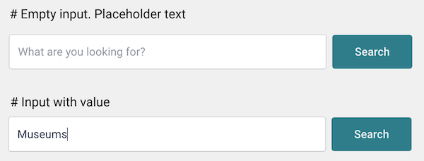

# Exercise 1: Search form

The purpose of the task is to implement the HTML (React) and CSS of a search form. The form looks like this:

We provide already a dumb component in `components/Search.js`. Right now it's a class component, but feel free to change it.

## Requirements

- The form doesn't need any behaviour. It just needs to show on the page
- ~~Use plain CSS for the styles.~~ __I chose to ignore this. I feel strongly about Object Orientated CSS as demonstrated by the OOCSS framework I've built for Wehkamp. For now I'm using Tailwind CSS (OOCSS Framework) so I don't have to built the framework myself, OOCSS offers a lot of benefits over "normal" css.__

## Colors, Fonts, Sizes

- All fonts are `Roboto 16px` (imported for you already).
- ~~The input and button are `50px` high.~~ __I feel this is bad practice. Button should never have a fixed height but a padding. If someone responsible for content uses a text that is too long for the button it will hide the text. It is the responsibility of the developer to not let this happen and make a nice fallback for when this happens (which is not a fixed height), essentially this normally doesn't change too much except for better & cleaner code. In my assigment I chose to make them 48px high (16px for font.size * 1.5 line-height + 16px vertical padding);__
- The width of the button should adapt to its content.
- The width of the input should adapt to the remaining space in the form.

~~Ignored the colors~~

| Element           | Color     |
| ----------------- | --------- |
| Input border      | `#D6D8DC` |
| Placeholder text  | `#ADB1BA` |
| Input text        | `#323C52` |
| Button background | `#018794` |
| Button color      | `#FFFFFF` |

__I'm sure everybody knows how to implement colors correctly. In my tailwind.config.js you can see some small adjustments to the colors tailwind provides by default. I made sure it looks ok, but didn't go as far to implement the exact colors here__

## Things to consider

- The form must be responsive. It must adapt to the width of the container.
- Imagine we want to reuse the `<input />` and the `<button>` in other places. How would you make those two pieces reusable?
- Is a spec file needed for this task? If yes, what would you test in the spec? If no, why not?
