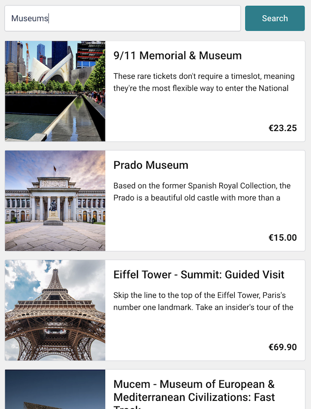

# Excercise 3: Search Results

The purpose of this task is to connect the search form and the API function of the previous tasks and render a list of search results below the form.

## Requirements

- The list updates when the user clicks on the button "Search", or they press the `Enter` key. The list **does not** update when the user types.
- ~~Use plan CSS for the styles.~~ __Again ignored. I used tailwindCSS__
- ~~The product summary must be limited to two lines.~~ I actually don't know a proper responsive way to do this. Normally you limit it to a number of characters, but that never is really perfect. I chose to use a css trick here: line-clamp which does what's asked. But only in CSS
- All prices are in EUR.
- Prices always have two decimals (i.e. `€19.00`)

## Colors, Fonts, Sizes

~~Ignored the colors~~
- All texts are `#323C52`
- The border is `#D6D8DC`.
- The title is `font: 500 22px 'Roboto'`
- The summary is `font: 400 16px/1.5 'Roboto'`.
- The price is `font: 700 18px 'Roboto'`.
- All paddings and margings are `16px`.
- The images are `200px` square.

## Things to consider

- The product cards must be responsive. They should adapt to the width of the container.
- ~~The user must be able to go to the product page. What parts should be clickable? Why?~~ Of course the entire card (unless there is a part going to a different page or part of the page, then you need to take that into account, and also the tap areas should be somewhat further apart in that case.)
- ~~Should the product page open in a new page? Why? Why not?~~ I guess this is a Product decision instead of a technical one. But there a not many reasons to open it in a new screen, see: https://css-tricks.com/use-target_blank/ If powerusers want to open in in a new screen anyway the can middle click.
